# 🛍️ fashion zero

A modern, fully responsive, and fully functional **fashion website** built with the **MERN stack** (MongoDB, Express, React, Node.js). This platform delivers a seamless and elegant shopping experience tailored specifically for the fashion industry — combining a **stylish user interface**, **advanced product interaction**, and **robust user personalization**.

It includes a comprehensive **Admin Panel** for managing products, orders, users, and reviews — making it ideal for real-world fashion retail operations.

> 💡 This is **not a clone** of any existing site — it has a **unique design and structure** developed from scratch with original styling, UX patterns, and features focused on fashion-first functionality.

## 📁 Project Type

**Frontend | Backend | Fullstack** → ✅ Fullstack

## 🚀 Live Demo

👉 [**fashion zero**](https://fashion-zero-client.onrender.com/)

## Video Walkthrough of the project
 👉 <a href="https://youtu.be/M6CnyEELyns">project presentation</a>

 ## 📝 Important Notes

✅ **Test Payments:**  
For testing card payments, use the following Stripe test card details:  
- **Card Number:** `4242 4242 4242 4242`  
- **Expiry Date:** Any future date (MM/YY)  
- **CVV:** Any 3-digit number  

⚠ **Deployment Info:**  
This project is hosted on **Render’s free tier**.  
- The backend may take **5–30 seconds** to wake up if idle (cold start).  
- First page load might be slightly delayed, but **subsequent requests will be fast**.


 ## ✨ Features

### 👤 User Features:
- Register & Login (JWT + HttpOnly Cookie)
- Phone Call & Email Verification
- Browse Products (by category, search, filters)
- Product Details (with ratings, stock by size/color)
- Add to Cart / Wishlist
- Size & Quantity Selector (Modal-based)
- Checkout (Shipping Info + COD/Card)
- Stripe Payment Integration
- My Orders Page (View, Cancel if Pending)
- Order Details Page
- Leave Product Reviews (Rating + Comment)
- Profile Dropdown (Edit Profile, Logout, etc.)

### 📦 Admin Features:
- Create / Edit / Delete Products
- Manage Orders & Users (via Postman or DB)
- Moderate Product Reviews

### 💬 Reviews System:
- Submit only after purchase (email link)
- Profanity Filtering
- Min length enforcement
- Moderation (pending, approved, rejected)
- Rating breakdown (stars + percentage bars)

### 📧 Email & Notifications:
- Order status email alerts
- Review reminder after delivery

## 🧰 Tech Stack

### 🔹 Frontend:
- React (JavaScript, no TypeScript)
- React Router DOM
- Plain CSS (custom styling)
- Axios (for HTTP requests)
- Stripe (for card payments)
- React Toastify (notifications)
- JWT (stored in HttpOnly cookies for security)

### 🔹 Backend:
- Node.js
- Express.js
- MongoDB (hosted on **MongoDB Atlas**)
- Mongoose (ODM for MongoDB)
- Stripe API (payment gateway)
- Twilio (for phone number verification)
- Nodemailer (for sending emails)
- Multiple utility packages:
  - `dotenv`, `bcrypt`, `cookie-parser`, `cors` and more

---

## 📁 Directory Structure

```bash
fashion-zero1/
├── client/
│ ├── node_modules/
│ ├── public/
│ ├── src/
│ │ ├── assets/
│ │ ├── components/
│ │ ├── layout/
│ │ ├── pages/
│ │ ├── services/
│ │ ├── styles/
│ │ ├── utils/
│ │ ├── .env
│ │ ├── .gitignore
│ │ ├── eslint.config.js
│ │ ├── index.html
│ │ ├── README.md
│ │ ├── package-lock.json
│ │ ├── package.json
│ │ └── vite.config.js
│
├── server/
│ ├── automation/
│ ├── controllers/
│ ├── database/
│ ├── middlewares/
│ ├── models/
│ ├── node_modules/
│ ├── routes/
│ ├── utils/
│ ├── views/
│ ├── .env
│ ├── .gitignore
│ ├── app.js
│ ├── package-lock.json
│ ├── package.json
│ └── server.js

```

## 👤 Author

- <a href="https://github.com/saif520">Saifuddin Dhali</a>

## 📝 License

This project is licensed under the MIT License — see the [LICENSE](./LICENSE) file for details.

## 🙏 Acknowledgments

- Special thanks to [MongoDB Atlas](https://www.mongodb.com/cloud/atlas) for cloud database hosting.
- Thanks to [Vite](https://vitejs.dev/) for fast frontend build tooling.
- Thanks to [Stripe](https://stripe.com/) for the payment gateway.
- Thanks to [Twilio](https://www.twilio.com/) and [Nodemailer](https://nodemailer.com/) for communication support.
- UI inspiration taken from modern fashion websites like Myntra, Nike, H&M, and Zara.

---

## 📸 Project Screenshots
---
### 💻 Desktop View  
---

### 🏠 Home Page
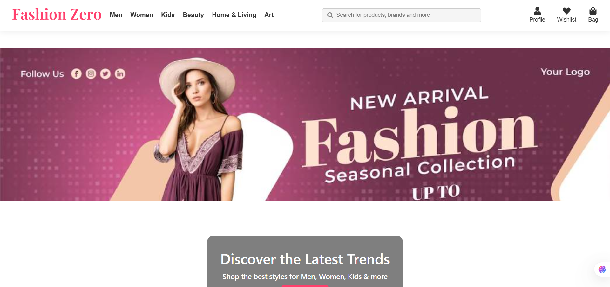

### 🛍️ All Products
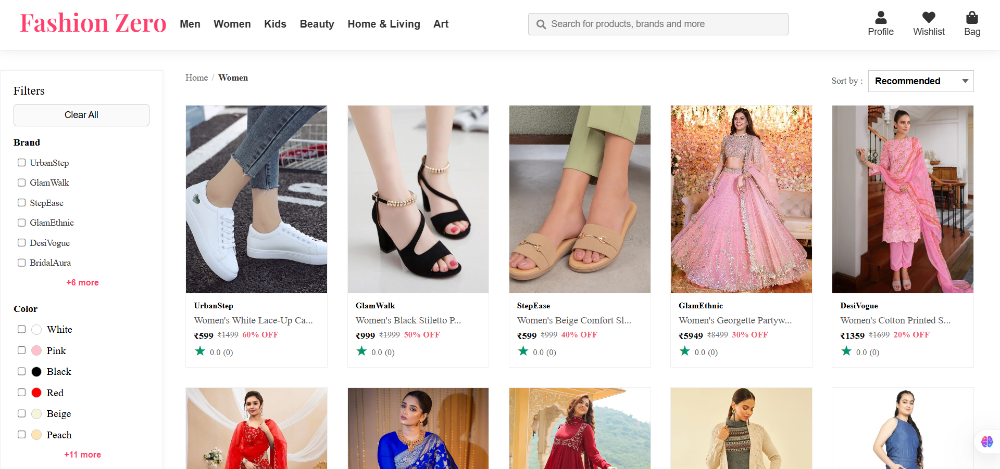

### 📄 Product Details
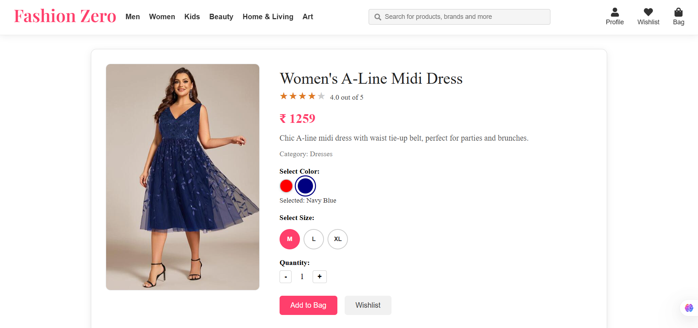

### ⭐ Review Section
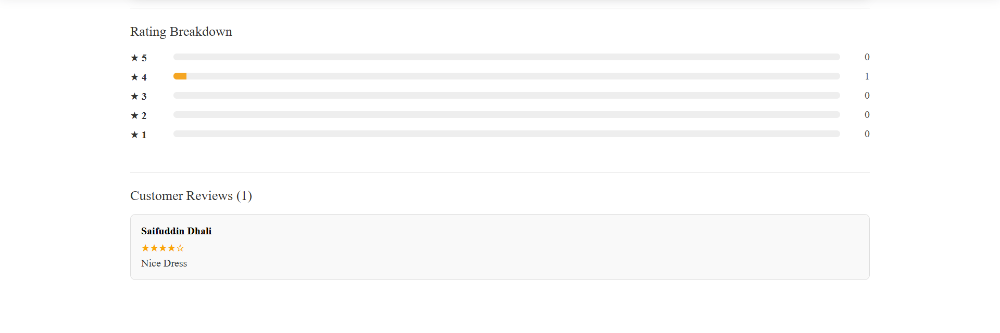

### ❤️ Wishlist
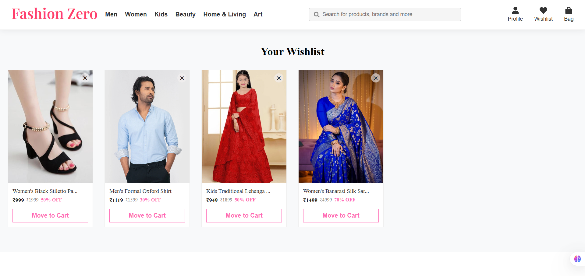

### 🛒 Cart
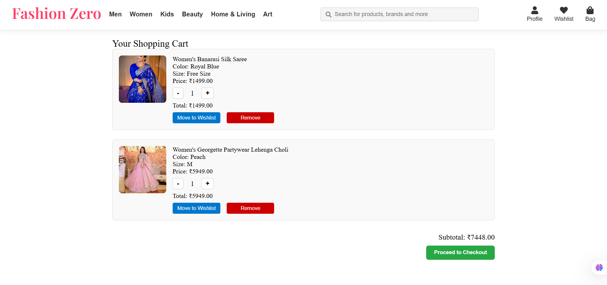

### ✅ Checkout
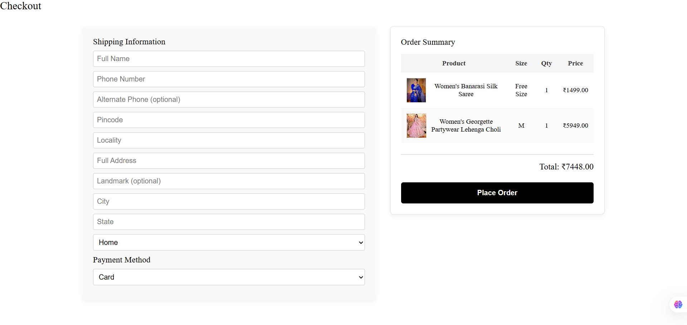

### 💳 Payment
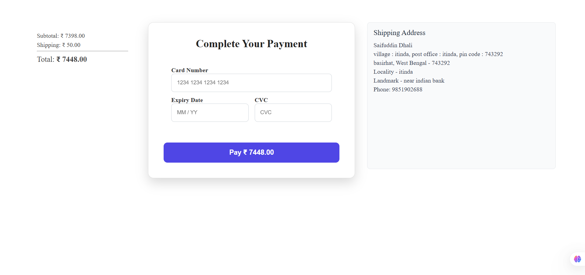

### 📬 Payment Status
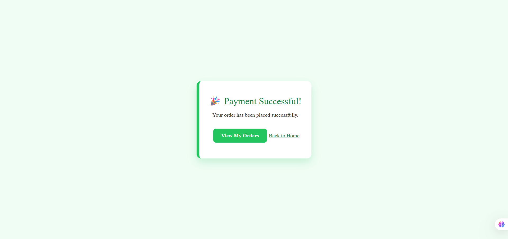

### 📦 My Orders
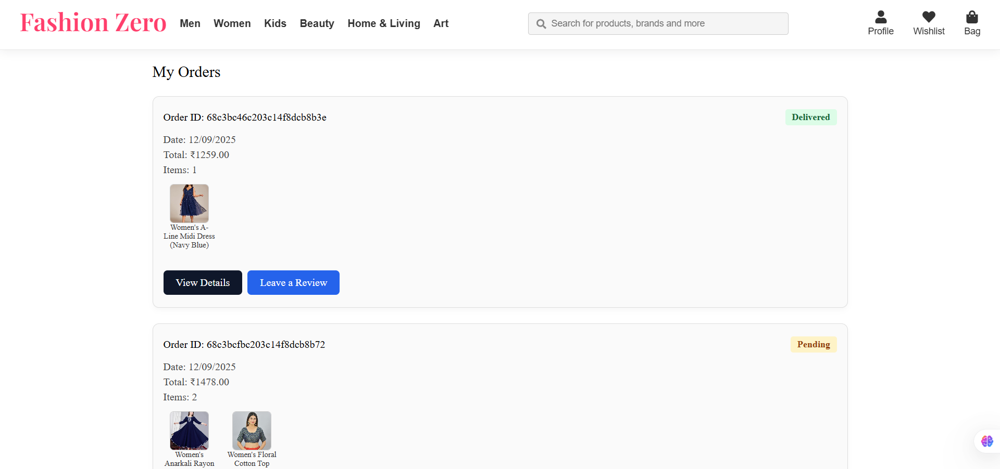

### 🔍 Order Details
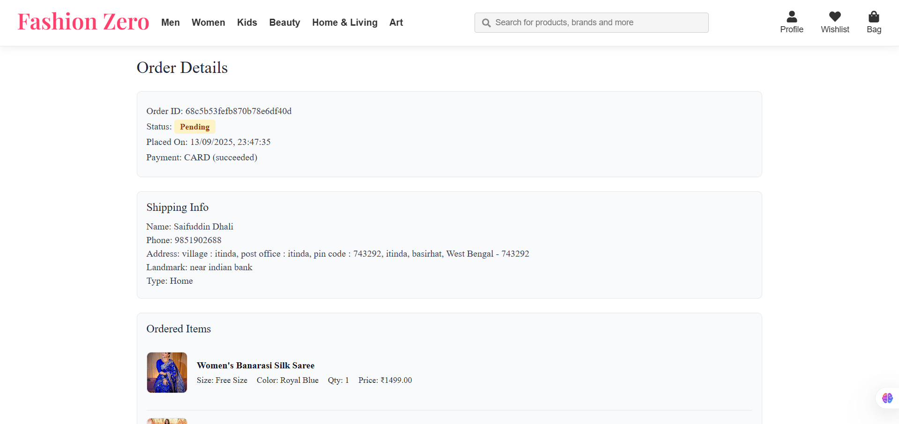

### ✍️ Review Page
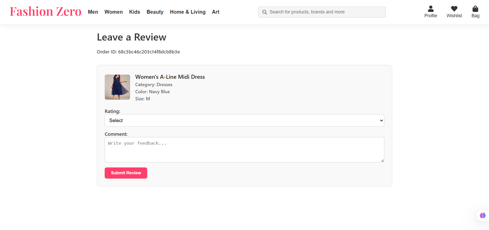

### 🧾 Register
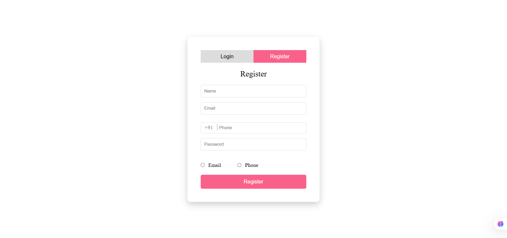

### 🔐 Login
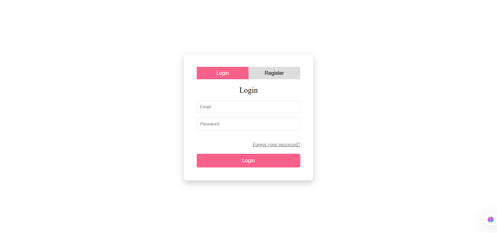

### 📲 OTP Verification


### 🔁 Forgot Password
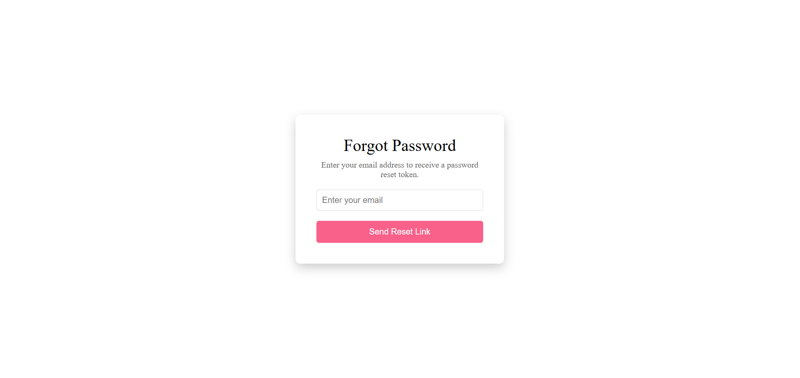

### 🔄 Reset Password
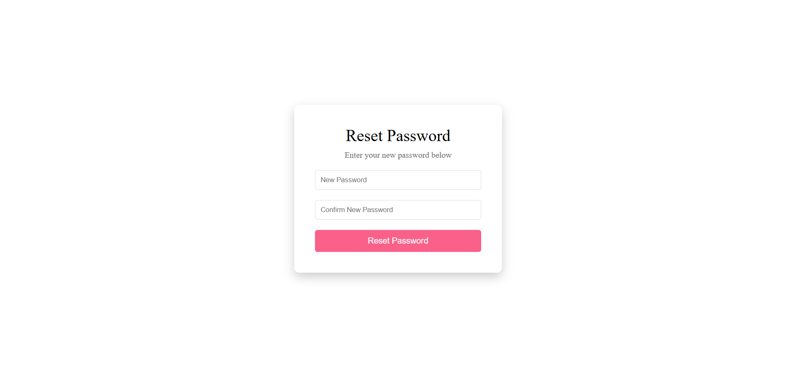

---
### 📱 Mobile View  
---


